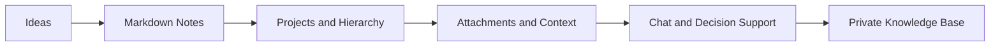

# SomeNoteTakingLLM

Self-hosted note taking platform for teams and power users who need privacy, structure and AI-ready knowledge management without giving up control of their data.

SomeNoteTakingLLM brings together Markdown notes, projects, hierarchical organization, attachments and contextual chat in a single workspace. The goal is simple: turn scattered information into an operational knowledge base that is private, extensible and ready to evolve with local AI.

## Why This Project Exists

Most note tools force one of two compromises: convenience without ownership, or flexibility without real structure. SomeNoteTakingLLM is being built to close that gap.

It is designed for people who want:

- full data ownership in a self-hosted stack
- a practical Markdown-first writing experience
- notes organized by projects, hierarchy and context
- chat tied to real notes instead of isolated prompts
- a clear path to local AI with Ollama and RAG
- a backend strong enough for long-term growth

## Product Vision



## What Makes It Different

- Self-hosted by default: your notes, files and workflows stay under your control.
- Built for knowledge operations: not just storing notes, but connecting ideas, files and conversations.
- AI-ready architecture: structured for future RAG workflows with Ollama.
- Modular foundation: backend in C#, MySQL persistence and Docker-based local environment.
- Practical collaboration path: project organization, role-based access and future integrations.

## Current Stack

- Backend: ASP.NET Core in C#
- Frontend: React
- Database: MySQL
- Local environment: Docker Compose
- Authentication: JWT-based foundation
- Next AI layer: Ollama + RAG

## Current Status

The project is already moving beyond concept and into implementation.

Available now:

- backend API scaffold in C#
- MySQL integration
- Docker Compose environment
- health endpoints for API and database
- frontend application shell with routes for login, dashboard, notes, projects, settings, onboarding and chat

In progress:

- authentication flow hardening
- project and note workflows
- onboarding and setup experience
- richer note editing and persistence
- AI-assisted note workflows

## Quick Start

Prerequisite: Docker Desktop running with Linux engine enabled.

```bash
docker compose up --build -d
```

Main entry points:

- Web: http://localhost:3000
- API: http://localhost:8080/health
- Database health: http://localhost:8080/health/db

## Multi-Architecture Build

Images are built for `linux/amd64` (x86) and `linux/arm64` (Raspberry Pi, Apple Silicon, ARM servers) using Docker Buildx.

**Local test build** (loads `linux/amd64` into the local daemon):

```powershell
.\Scripts\build-multiarch.ps1 -Load
```

**Build and push to a registry:**

```powershell
.\Scripts\build-multiarch.ps1 -Push -Registry "docker.io/your-user"
.\Scripts\build-multiarch.ps1 -Push -Registry "ghcr.io/your-user" -Tag "v1.0.0"
```

**Declarative build via bake** (useful in CI/CD pipelines):

```bash
REGISTRY=ghcr.io/your-user TAG=v1.0.0 docker buildx bake --push
```

All base images (`dotnet:9.0`, `node:20-alpine`, `nginx:alpine`) ship official multi-arch manifests, so no Dockerfile changes are needed.

## Who This Is For

- teams building an internal knowledge base
- consultants and researchers who need structured notes
- developers who want private, AI-assisted documentation
- organizations that cannot depend on third-party SaaS for sensitive information

## Road Ahead

- robust IAM and RBAC
- project-centered note workflows
- nested notes and richer editor capabilities
- attachments and previews
- contextual chat linked to notes
- Ollama integration with RAG pipelines
- modular connectors such as Paperless, GitHub and Nextcloud

## Repository Structure

- `SRC/SomeNoteTakingLLM.Api` — backend API in C#
- `SRC/sntllm-web` — frontend React application
- `Scripts/` — helper scripts for local execution and multi-arch builds
- `Docs/MD/` — implementation plan and architectural documentation
- `docker-compose.yml` — local development environment
- `docker-bake.hcl` — declarative multi-arch build definition

## Summary Pitch

SomeNoteTakingLLM is building a private second brain for serious work: a self-hosted platform where notes, projects, files and AI context live together in one extensible system.
